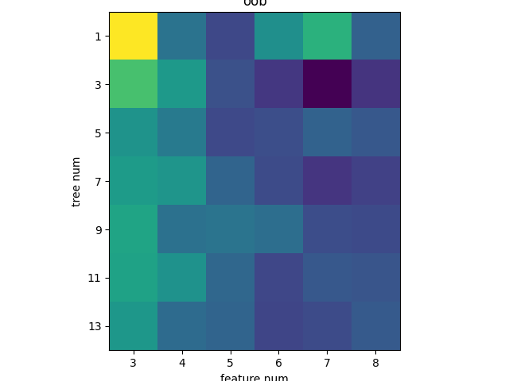
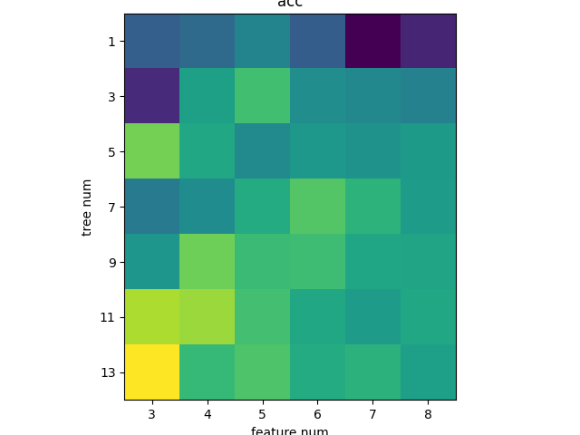
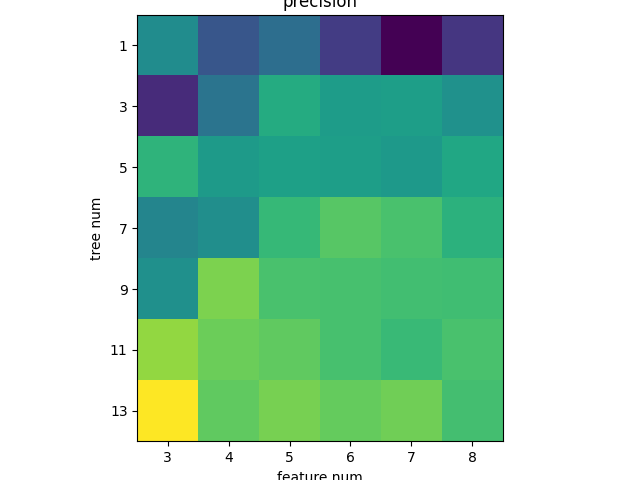
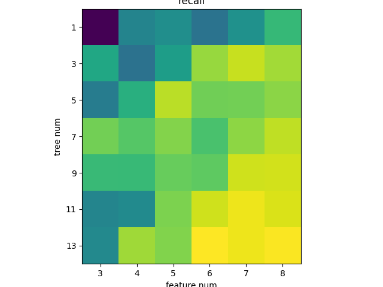
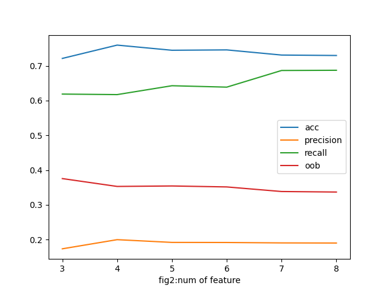
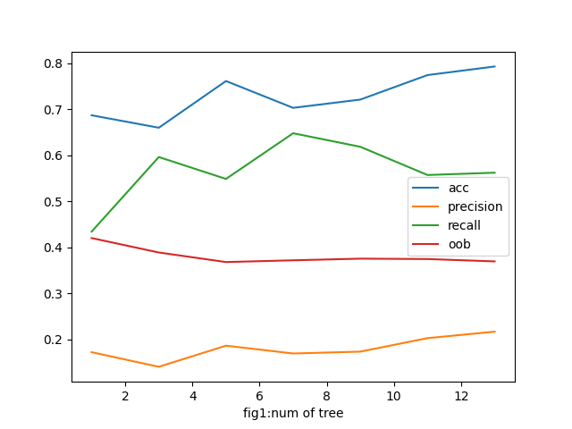
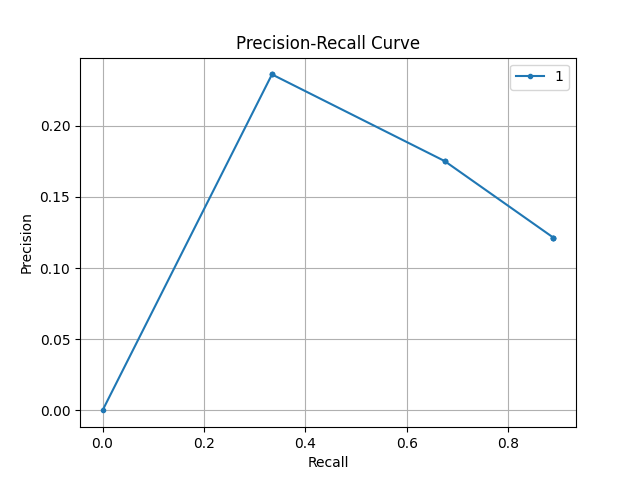
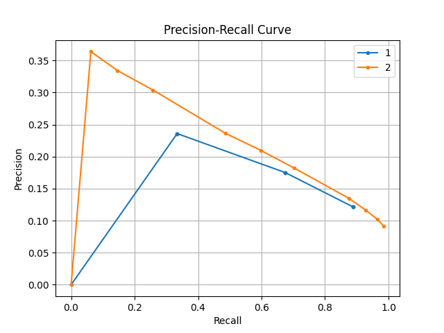

# <center>实验报告</center>

<center>刘子源 无研223 2022310709</center>

#### 数据预处理

经检验，本数据不存在数据缺失和数值差异大的问题。

数据集中存在非数值特征，但由于我采用CART分类树作为基分类器，CART分类树对可以同时处理非数值数据与数值类数据，故非数值数据也无需处理。

数据集中共有319795例样本，正例样本27373，反例样本292422，存在严重的样本不均衡问题。为解决样本不均衡问题，且同时兼顾居家办公电脑算力问题，我采用的方法是取后5%数据固定为测试集，将前95%的数据分出正例和反例样本，再各取5000个样本，最终构成样本量为10000的训练集。

#### 模型构建

使用CART分类树作为基分类器，并对比树木数、选取特征数对各项指标的影响。最小分类样本设置为30。

分类时，随机森林调用多课CART树进行分类，最后根据多棵CART树的分类结果投票选出随机森林的判断结果。训练时每棵CART树独立有放回地选出等于训练集大小的样本作为对应训练集。

CART树与随机森林都自行实现。

树木数从$1,3,...,13$变化，特征数从$3,4,...,9$变化，共构建了$7\times6=42$组模型。

#### 模型选择

使用 out-of-bag error(oob error) 进行模型选择，并绘制了二维热力图直观对比各模型性能



如上图所示，随着树和特征数目的增多，oob error呈现出下降的整体趋势，这是很直观的；当只有1棵决策树，只选取3个特征时，oob error是最大的，此时的模型稳定性是最差的，实验结果与理论相符；当决策树数目为3，特征数目为7时，oob error最小，达到了0.31294158，根据此指标的话应选择这个模型。

下图为accuracy、precision、recall的热力图。随着树木数和特征数的增多，它们都呈现出了上升的趋势，相应的代价是模型的复杂度也随之增长。







下图分别为固定树木树，各指标随特征数的变化及固定特征数，各指标随树木数的变化，对应着上面的热力图横向和纵向的变化趋势，变化趋势与预期相符。

注意到precision偏低，这是合理的，因为这是一个样本极不均衡的数据集，对precision的影响很大，且我只取了其中约$\frac{1}{32}$的样本训练模型。





上述4个指标的具体数值见附录。

#### 模型评价

对于严重不均衡的数据集，使用 Area Under Precision-Recall Curve (AUPRC) 作为评价指标是更好的选择。

根据oob error选择的模型的AUPRC如下图所示：



我在随机测试其他模型的AUPRC并与上图对比时发现，oob error选择的模型并不是最优的。例如，由于这是一个不均衡的数据集，我更倾向于重视precision指标，于是我选取precision最高、恰好同时accuracy也是最高的模型，即13棵树、3个特征时，测试其AUPRC曲线，如下图所示：



可见相比于oob error选出的模型，根据accuracy和precision选出的模型具有显著的优势。

#### 附录1

accuracy、precision、recall、oob error具体数值如下所示

```python
acc
[[0.6870669  0.6935835  0.70998126 0.68616635 0.6412508  0.65671045]
 [0.66005003 0.7275297  0.7470419  0.71584743 0.7119825  0.7080425 ]
 [0.7614509  0.7319074  0.71348345 0.7221263  0.71926206 0.7240775 ]
 [0.703202   0.71527207 0.73478425 0.7524953  0.73926204 0.72442776]
 [0.7211632  0.7594622  0.7446404  0.74569106 0.7308568  0.7295935 ]
 [0.77438396 0.7704315  0.74745464 0.73219514 0.72489053 0.73186994]
 [0.7930331  0.74308944 0.75129455 0.7348718  0.7390619  0.7266542 ]]
pre
[[0.17240319 0.15337935 0.16161038 0.1455962  0.13003144 0.14389852]
 [0.14072095 0.16349992 0.18359537 0.17799944 0.17887905 0.17400642]
 [0.18659179 0.17734748 0.17938599 0.17869653 0.17724355 0.18194905]
 [0.16963673 0.1730414  0.18836837 0.19449537 0.19211383 0.18580422]
 [0.17367691 0.19997172 0.19208366 0.19182752 0.19064213 0.19028682]
 [0.20294322 0.19755991 0.1958751  0.19170801 0.18900634 0.19199374]
 [0.21703316 0.1956791  0.19903736 0.19659619 0.1982274  0.19098398]]
recall
[[0.43438438 0.55675673 0.56891894 0.537988   0.57117116 0.61606604]
 [0.5963964  0.5367868  0.58573574 0.663964   0.6831832  0.66801804]
 [0.5487988  0.6054054  0.6776276  0.6472973  0.6475976  0.6584084 ]
 [0.64804804 0.6346847  0.65585583 0.62747747 0.6599099  0.68003005]
 [0.6186186  0.6171171  0.6426426  0.6385886  0.6864865  0.68708706]
 [0.5573574  0.5647147  0.6521021  0.68573576 0.6984985  0.6906907 ]
 [0.5623123  0.66726726 0.6542042  0.7057057  0.6990991  0.70405406]]
oob
[[0.42032528 0.35364926 0.33630207 0.36650246 0.38148648 0.34609842]
 [0.38901687 0.3707181  0.33970162 0.33041516 0.31294158 0.3289655 ]
 [0.36824965 0.35682854 0.3367839  0.3389469  0.3467501  0.34255433]
 [0.37205505 0.3690078  0.3473935  0.33747548 0.32936367 0.33371332]
 [0.37561342 0.35303456 0.35438    0.35161304 0.33842298 0.3369254 ]
 [0.3748214  0.3678307  0.3486135  0.33578363 0.34245563 0.34138837]
 [0.36967656 0.35046893 0.34762055 0.3355703  0.3376213  0.343499  ]]
```

#### 附录2

**文件清单**

report.pdf：实验报告

heart_2020_cleaned.csv：数据集文件

HW2_sampled.py：模型构建、训练、测试等

draw.py：绘制oob error、AUPRC等