# 
实验报告

刘子源 无研223 2022310709

#### 模型搭建

**预处理**

原始图像是$134\times134\times3$的图像，观察到其色彩单一，不会提供有用的信息，所以先将图片灰度化；观察到字母周围有大块的空白，所以将图片crop到$80\times80$的尺寸；最终，将原始输入转化为$80\times80\times1$的Tensor。

**模型结构**

网络包含了2个卷积层、2个池化层、3个全连接层、batchnorm和dropout等模块，具体结构如下图所示：

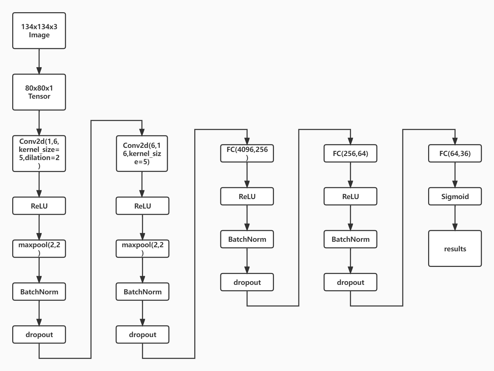

**参数设置**

随机划分70%作为训练集，30%作为测试集

损失函数：交叉熵

激活函数：ReLU

学习率：0.01

优化器：Adam

batch size：128

epoch：500或300

dropout rate：0.5

其中，学习率和优化器的选取过程见附录2。

**参数量估算**

卷积层1：$1\times5\times5\times6+6=156$

卷积层2：$6\times5\times5\times16+16=2416$

全连接层1：$4096\times256+256=1048832$

全连接层2：$256\times64+64=16448$

全连接层3：$64\times36+36=2340$

池化层：0

dropout层：0

batchnorm层：$4\times batch\ size\times4=2048$

综上，网络共有1072240个参数

此外，模型中还有学习率，Adam中$\beta_1,\beta_2$等超参数。

#### 实验结果

引入batchnorm与dropout的收敛曲线如下：

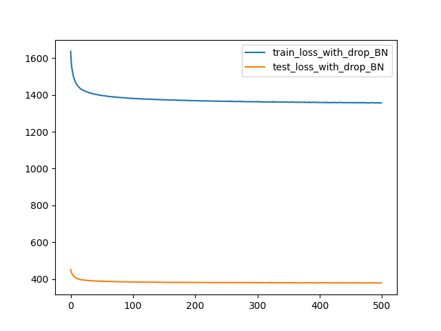

top-1 准确率和 top-5 准确率变化如下：

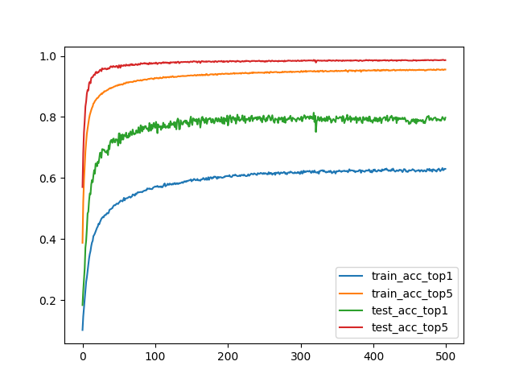

未引入batchnorm与dropout的收敛曲线如下：

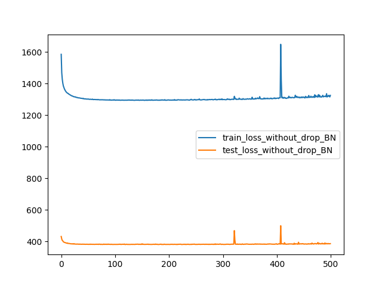

top-1 准确率和 top-5 准确率变化如下：

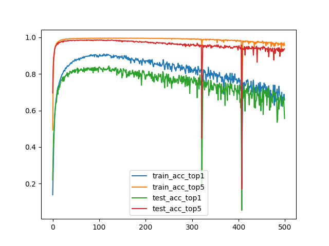

模型分类正确率表如下：

|                   | 添加BN与dropout | 未添加BN与dropout |
| :---------------: | :-------------: | :---------------: |
| 训练集top-1正确率 |     0.6298      |      0.6568       |
| 训练集top-5正确率 |     0.9555      |      0.9564       |
| 测试集top-1正确率 |     0.7977      |      0.5557       |
| 测试集top-5正确率 |     0.9863      |      0.9367       |

**总结**

1.在训练集上，未添加BN与dropout的模型的top-1和top-5正确率更高；在测试集上，添加BN与dropout的模型的top-1和top-5正确率显著高于未添加的模型，说明BN层和dropout层对提升模型性能有很大帮助。

2.观察到模型没有dropout层时，在训练集上的准确率比测试集上高；有dropout层时，在测试集上的准确率比训练集要高。这是正确的，因为训练时dropout层会随机去掉一些节点以防过拟合，所以只有在测试时模型才能发挥100%的能力。

3.从收敛曲线图当中可以看出添加了BN与dropout层后，收敛速度更慢，训练集上准确率大约在300个epoch时才收敛，未添加BN和dropout层收敛速度较快，100个epoch左右已经收敛。

4.从收敛曲线图当中可以看出添加了BN与dropout层后，迭代500个epoch后模型仍未过拟合，而未添加BN和dropout层在100个epoch后，其top-1和top-5准确率就开始下降，在300个epoch后，准确率和loss的曲线上甚至出现了异常值，说明模型此时已经过拟合。综上可以说明添加BN与dropout层有助于提高网络泛化性能，防止过拟合。

#### 探究不同dropout rate下 CNN 模型的性能

上述实验可以看出，dropout对提高模型准确率，防止过拟合起到了重要的作用，于是我进一步探究了在不同的dropout rate的配置下，模型的 top-1 准确率、 top-5 准确率以及loss的变化规律。

令dropout rate从0.1到0.9变化，步长为0.1，epoch为300，其他参数保证一致，训练集、测试集上的准确率及loss结果如下图所示：

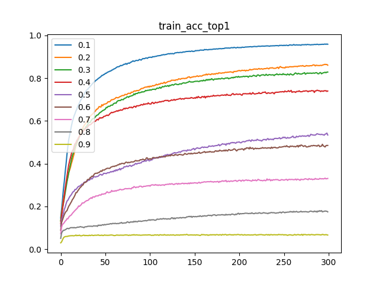

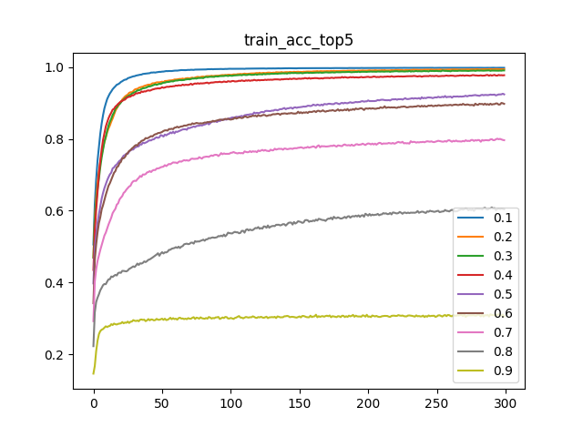

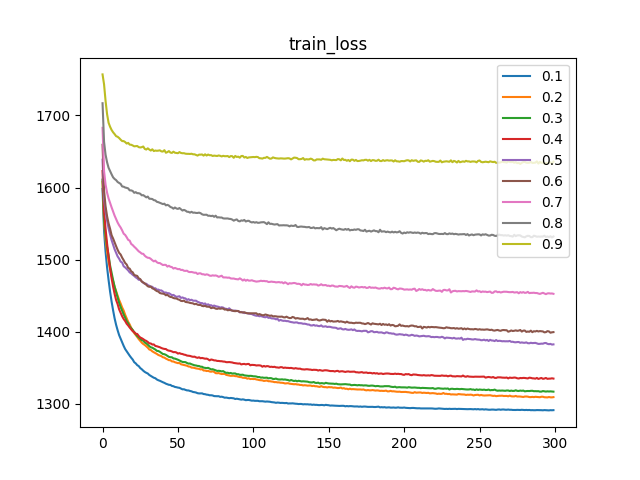

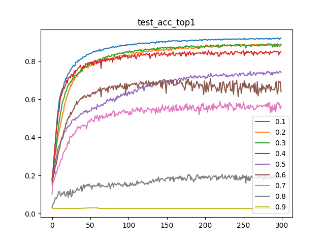

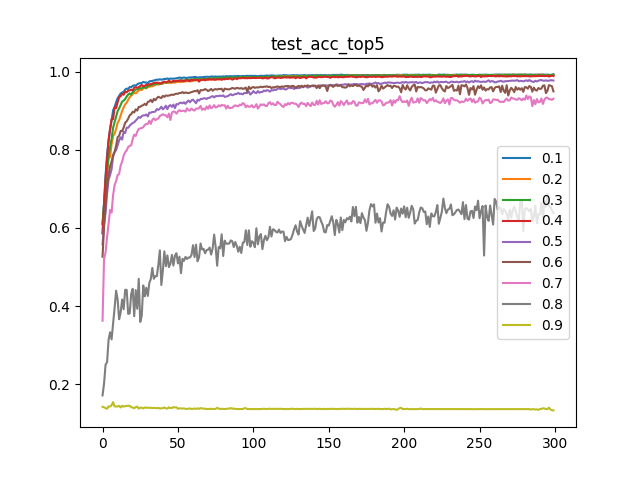

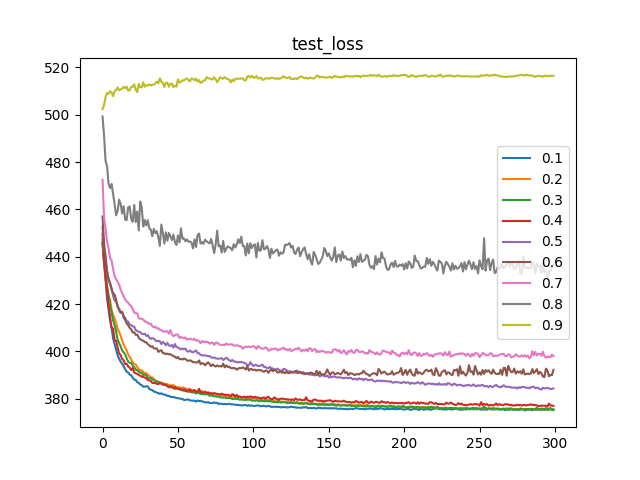

若对不同dropout rate下的训练集和测试集上的top-1准确率、top-5准确率、loss的具体数值表感兴趣，您可以参照附录1运行draw_dp.py文件获取结果。

更多详细结果见附录3。

**分析**

1.在dropout rate为0.9时，训练时有90%的节点未激活。模型不收敛；在dropout rate为0.8时，模型收敛极慢，300个epoch时未收敛；对于可收敛的模型，在不同dropout rate设置下准确率和loss的收敛趋势及速度一致。

2.dropout rate为0.1时在训练集上的top-1、top-5准确率和loss、测试集上top-1准确率均为最高；dropout rate为$0.1\sim0.4$时在测试集上的loss和top-5准确率相差不大。

### 附录1

**文件清单**

report.pdf：实验报告

code：代码文件，将数据文件夹archive与代码文件放于同一目录下，首先运行Final_adam_top5.py得到训练数据与正确率图，之后运行draw.py得到loss图；若想获得在不同dropout rate下模型准确率及loss的变化图，需将数据文件xxx.pkl放在同一目录下，运行draw_dp.py；您也可以调用我保存好的各种模型文件xxx.pth复现实验并在此基础上做任意改动；模型文件及数据文件见网盘https://cloud.tsinghua.edu.cn/d/b4653391ad8f443bb93e/

#### 附录2

**如下为学习率及优化器的选取过程：**

我最初使用的是SGD优化器，在0.04的学习率下训练，有BN和dropout的模型未收敛

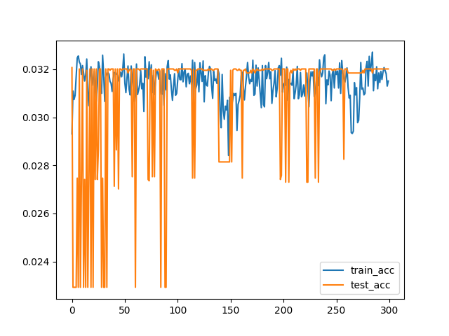

未添加BN和dropout的模型准确率有随迭代次数上升，但随后迅速降至0附近，训练失败

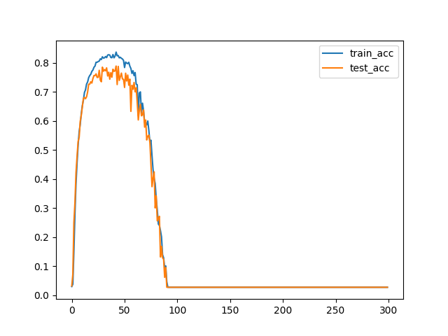

调整学习率为0.01和0.005训练，模型收敛，但收敛速度很慢

学习率0.01：

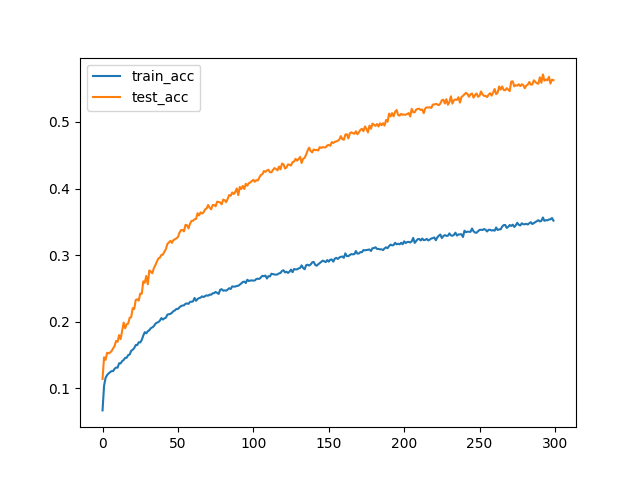

学习率0.005：

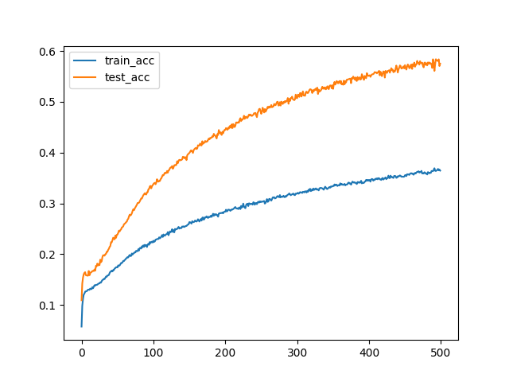

换用Adam优化器，设置学习率0.01，只测试top-1准确率，训练效果非常好

添加BN和dropout的模型，在500个epoch后仍未有明显过拟合现象：

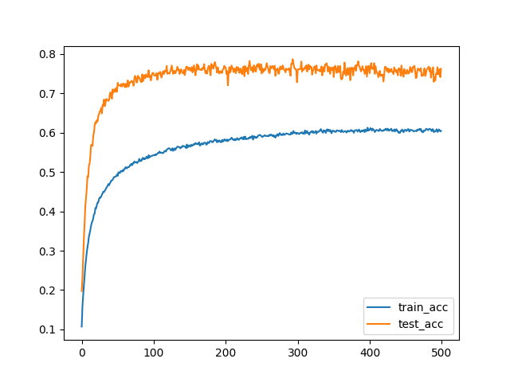

未添加BN和dropout的模型，快速收敛后发生过拟合现象，但未出现准确率大幅度降低的极端情况，符合预期

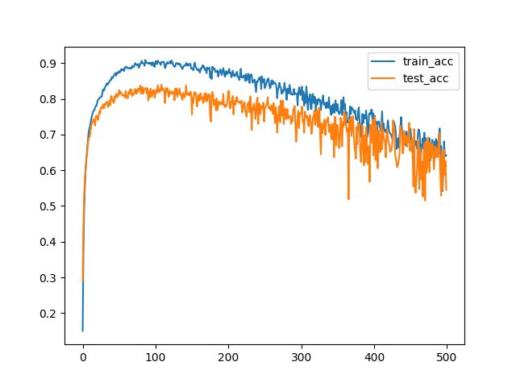

综上，于是我选择使用Adam优化器和0.01的学习率进行实验。

#### 附录3

**如下为在0.1至0.9的dropout rate配置下，各种准确率的变化：**

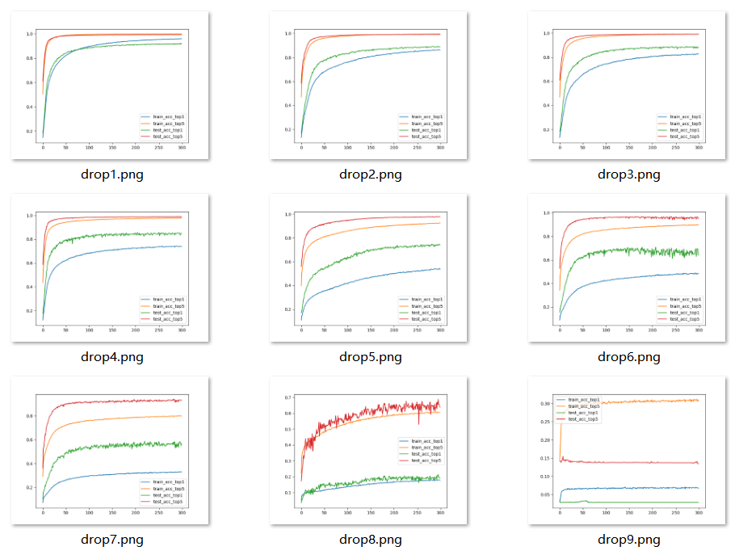

**如下为在0.1至0.9的dropout rate配置下，loss的变化：**

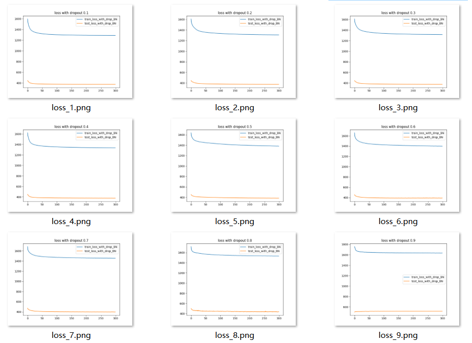

